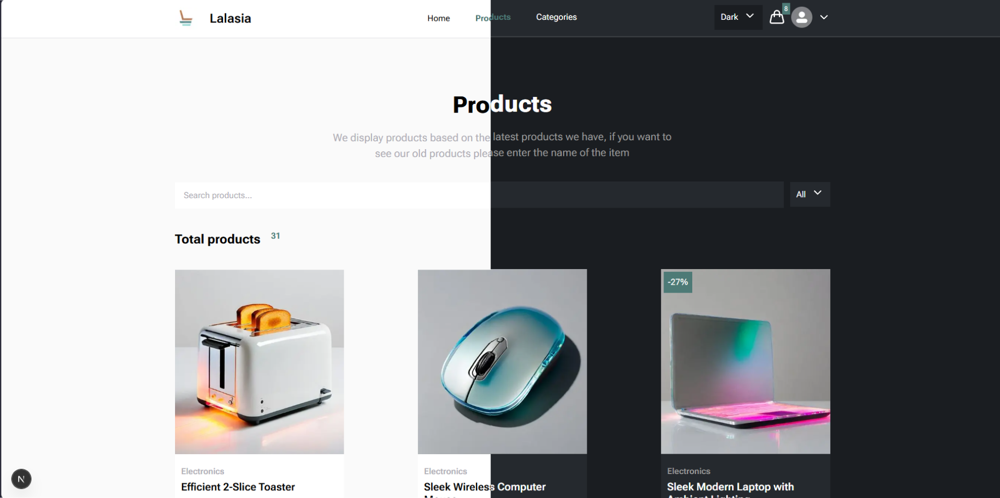

# e-commerce-project-kts

> [!WARNING]
> предполагается что все действия будут происходить из корня проекта

## Клонирование репозитория

```cmd
git clone https://github.com/nais2008/e-commerce-project-kts-next
cd ./e-commerce-project-kts-next
```

## Заполнение переменных среды

### Создание файла

```cmd
touch .env
```

### Заполняем

```env
VITE_NEXT_PUBLIC_STRAPI_TOKENSTRAPI_TOKEN=your_strapi_token
```

## Установка зависимостей

```cmd
npm install
```

## Запуск

```cmd
npm run dev
```

## Вид приложения


